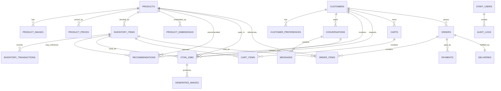

# MTP Phase 1 — Database ER Diagram

```mermaid
erDiagram
    PRODUCTS ||--o{ PRODUCT_IMAGES : has
    PRODUCTS ||--o{ PRODUCT_PRICES : priced_by
    PRODUCTS ||--o{ INVENTORY_ITEMS : stocked_as
    INVENTORY_ITEMS ||--o{ INVENTORY_TRANSACTIONS : records
    PRODUCTS ||--o{ PRODUCT_EMBEDDINGS : embedded_as

    CUSTOMERS ||--o{ CUSTOMER_PREFERENCES : has
    CUSTOMERS ||--o{ CONVERSATIONS : starts
    CONVERSATIONS ||--o{ MESSAGES : contains
    CUSTOMERS ||--o{ RECOMMENDATIONS : receives
    PRODUCTS ||--o{ RECOMMENDATIONS : recommended
    INVENTORY_ITEMS ||--o{ RECOMMENDATIONS : may_reference

    CUSTOMERS ||--o{ VTON_JOBS : requests
    PRODUCTS ||--o{ VTON_JOBS : used_in
    INVENTORY_ITEMS ||--o{ VTON_JOBS : used_for
    CONVERSATIONS ||--o{ VTON_JOBS : initiated_from
    VTON_JOBS ||--o{ GENERATED_IMAGES : produces

    CUSTOMERS ||--o{ CARTS : owns
    CARTS ||--o{ CART_ITEMS : contains
    INVENTORY_ITEMS ||--o{ CART_ITEMS : selected

    CUSTOMERS ||--o{ ORDERS : places
    ORDERS ||--o{ ORDER_ITEMS : contains
    PRODUCTS ||--o{ ORDER_ITEMS : references
    INVENTORY_ITEMS ||--o{ ORDER_ITEMS : sold_as
    ORDERS ||--o{ PAYMENTS : paid_by
    ORDERS ||--|| DELIVERIES : fulfilled_by

    STAFF_USERS ||--o{ AUDIT_LOGS : creates
```
